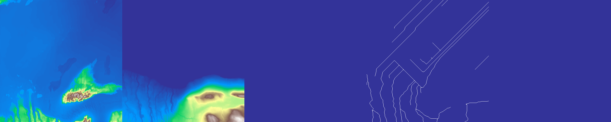
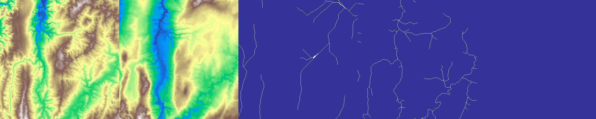
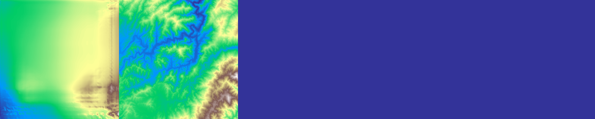
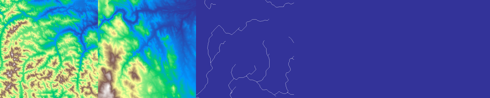
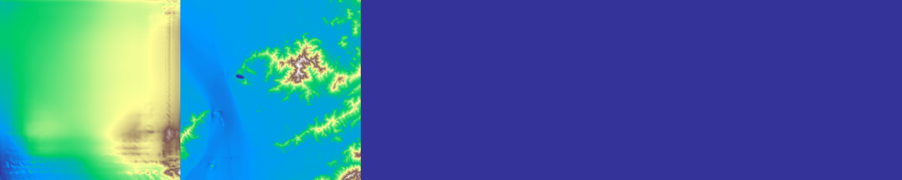
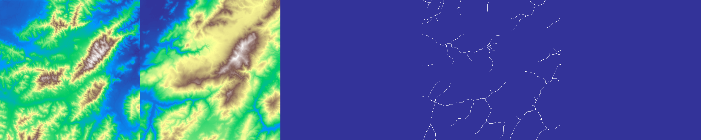
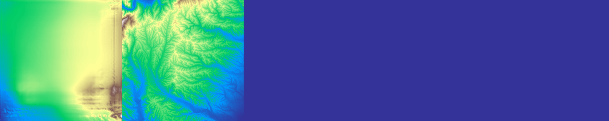
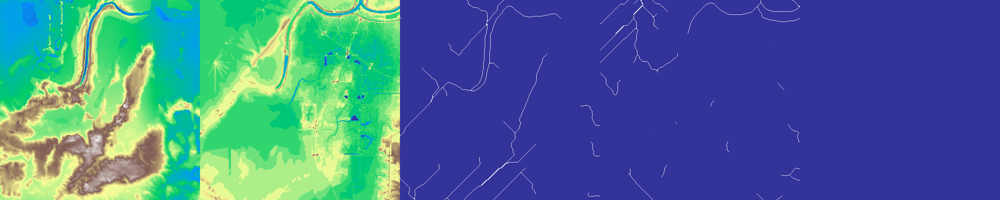

# Interactive-Adversarial-Terrain-Generation
This project attempts to create a terrain authoring tool that simplifies the creation of elevation maps used in interactive applications.
## Training output examples

On the left is the generated image. Second image is the target and right images are user sketches.
Sketches are extracted from the target image through water flow analysis then randomly dropped.
